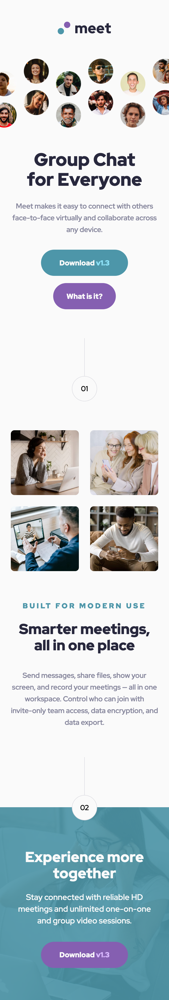
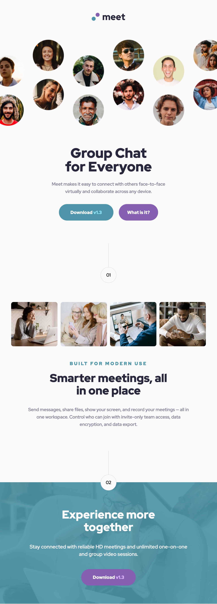

# Frontend Mentor - Meet landing page solution

This is a solution to the [Meet landing page challenge on Frontend Mentor](https://www.frontendmentor.io/challenges/meet-landing-page-rbTDS6OUR). Frontend Mentor challenges help you improve your coding skills by building realistic projects. 

## Table of contents

- [Overview](#overview)
  - [The challenge](#the-challenge)
  - [Screenshots](#screenshots)
  - [Links](#links)
- [My process](#my-process)
  - [Built with](#built-with)
- [Author](#author)

**Note: Delete this note and update the table of contents based on what sections you keep.**

## Overview

### The challenge

Users should be able to:

- View the optimal layout depending on their device's screen size
- See hover states for interactive elements

### Screenshots

### Links

- Solution URL: [Frontend Mentor](https://www.frontendmentor.io/solutions/responsive-mobile-first-design-using-css-flexbox-and-sass-pKaPzd4yn)
- Live Site URL: [Vercel](https://fem-meet-landing-page.vercel.app/)

## My process

### Built with

- Semantic HTML5 markup
- Sass
- Flexbox
- Mobile-first workflow

## Author

- Codepen - [@anglicus](https://codepen.io/anglicus)
- Frontend Mentor - [@anglicus](https://www.frontendmentor.io/profile/anglicus)
- FreeCodeCamp [@anglicus] (https://www.freecodecamp.org/anglicus)
